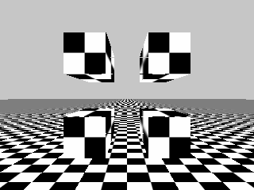
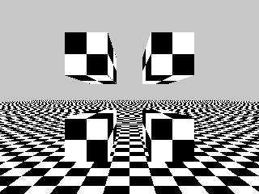
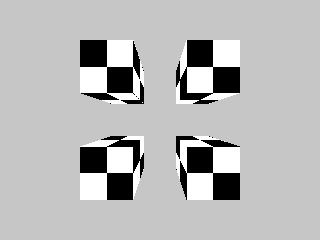
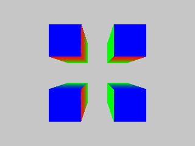

# A software 3D rasteriser in Zig

## Features
* pipelines consisting of user defined Vertex and Fragment shaders
* attributes, uniforms, varyings
* projection matrices
* perspective correct varying interpolation
* depth buffers and testing
* mipmap generation and trilinear texture sampling
* tga image output

## TODO
* face culling
* anisotropic filtering
* demo features:
  * matrix mult
  * matrix lookat
  * vec cross product
  * normals
  * lighting
  * model loading

