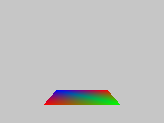

# A software 3D rasteriser in Zig

## Features
* pipelines consisting of user defined Vertex and Fragment shaders
* attributes, uniforms, varyings
* projection matrices
* perspective correct varying interpolation
* tga image output

## TODO
* texturing (bilinear sampling)
* mipmap selection
* depth buffers and testing

